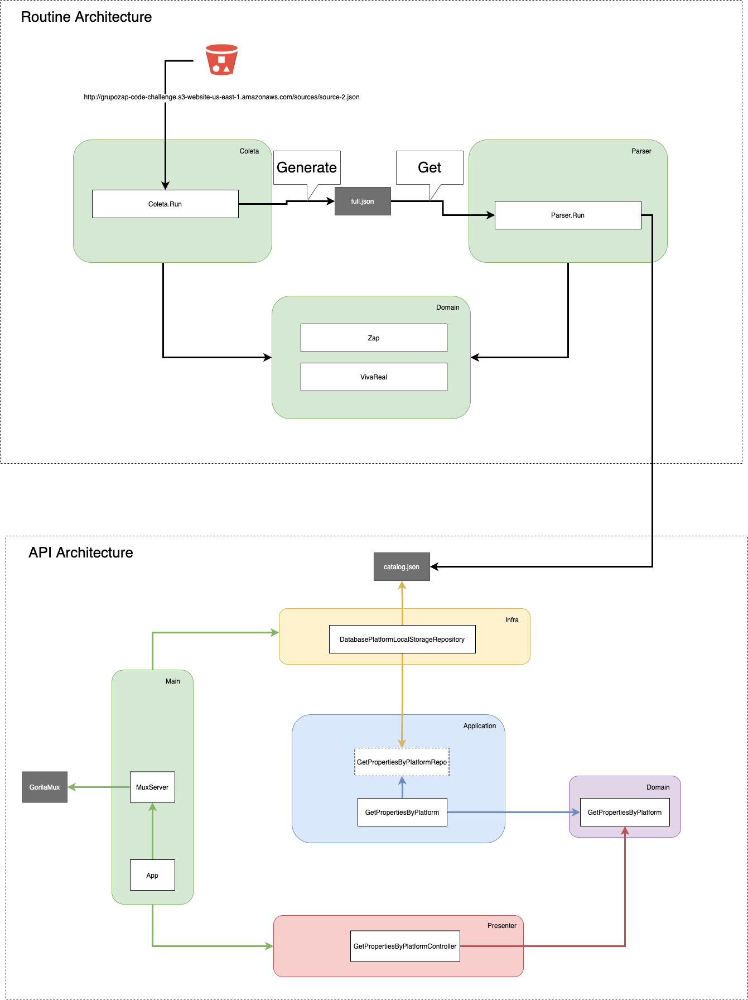

# Interview Olx

## Tecnologies
 - Golang
 - Docker
 - Nginx

## Design Pattern
 - Factory
 - Dependency Injection

## Project
### Start Project
#### 1 - Step
 **If want to run local**
```bash
$ go run ./main.go
```
**If want to run in docker**
```bash
$ make build
$ make start
```

### Routes
> Host

`http://localhost:4513/`

ou

`http://localhost:4514/`

**If you using a make file to run the application**
> Host

`http://localhost:4000/`

**This is 'cause I use Nginx to proxy port 4513 and 4514**

> Get Imoveis
 - GET `/search/{platform}`
 - Params
    - platform: string

> Get Imoveis With Paginate
 - GET `/search/{platform}?page=<Number>`
 - Params
    - platform: string
 - Query param
    - page: integer

## Run test
 **If want to run local**
```bash
$ make test-local
```
**If want to run in docker**
```bash
$ make test-docker
```

## Deploy
- 1 - Step

```bash
$ git clone git@github.com:elissonalvesilva/eng-zap-challenge-golang.git
```
- 2 - Step
**If you want to run using docker**
```bash
$ docker build -t olx-application .
$ docker run olx-application
```
**If you want to run using golang binary**
```bash
$ go mod download
$ CGO_ENABLED=0 GOOS=<SO> go build -o main ./main.go
$ main
```
**If you want to run using docker-compose**
```bash
$ docker-compose up -d
```


## Architecture
